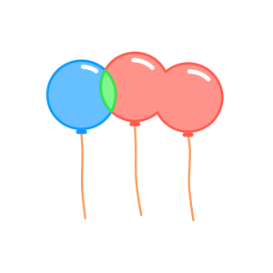
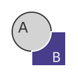

# iOverlay

<p align="center">


</p>

The iOverlay is a fast poly-bool library supporting main operations like union, intersection, difference, and xor, governed by either the even-odd or non-zero rule. This algorithm is based on Vatti clipping ideas but is an original implementation.


## [Documentation](https://ishape-rust.github.io/iShape-js/overlay/stars_demo.html)
Try out iOverlay with an interactive demo:

- [Stars Rotation](https://ishape-rust.github.io/iShape-js/overlay/stars_demo.html)
- [Shapes Editor](https://ishape-rust.github.io/iShape-js/overlay/shapes_editor.html)


## Features

- **Operations**: union, intersection, difference, and exclusion.
- **Polygons**: with holes, self-intersections, and multiple paths.
- **Simplification**: removes degenerate vertices and merges collinear edges.
- **Fill Rules**: even-odd and non-zero.

## Getting Started

Add the following to your Cargo.toml:
```
[dependencies]
i_float
i_shape
i_overlay
```

### Hello world

Let's union two squares
```rust
let mut overlay = Overlay::new(1);

let subj = [
    FixVec::new_number(-10, -10),
    FixVec::new_number(-10, 10),
    FixVec::new_number(10, 10),
    FixVec::new_number(10, -10),
];

let clip = [
    FixVec::new_number(-5, -5),
    FixVec::new_number(-5, 15),
    FixVec::new_number(15, 15),
    FixVec::new_number(15, -5),
];

overlay.add_path(&subj.to_vec(), ShapeType::Subject);
overlay.add_path(&clip.to_vec(), ShapeType::Clip);
let graph = overlay.build_graph(FillRule::NonZero);

let shapes = graph.extract_shapes(OverlayRule::Union);

println!("shapes count: {}", shapes.len());

if shapes.len() > 0 {
    let contour = shapes[0].contour();
    println!("shape 0 contour: ");
    for p in contour {
        let x = p.x.f32();
        let y = p.x.f32();
        println!("({}, {})", x, y);
    }
}
```

# Overlay Rules

## Union, A or B


## Intersection, A and B


## Difference, B - A


## Exclusion, A xor B

