# iOverlay

[](https://crates.io/crates/i_overlay)
[](https://docs.rs/i_overlay)
[](https://github.com/iShape-Rust/iOverlay/actions/workflows/tests.yml)
[](https://codecov.io/gh/iShape-Rust/iOverlay)

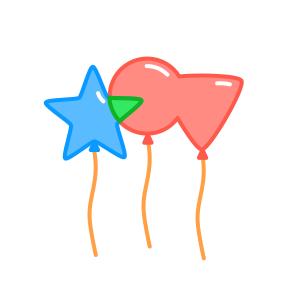

The iOverlay library provides high-performance boolean operations on polygons, including **union**, **intersection**, **difference**, and **xor**. It is designed for applications that require precise polygon operations, such as computer graphics, CAD systems, and geographical information systems (GIS). By supporting both integer (`i32`) and floating-point (`f32`, `f64`) APIs, iOverlay offers flexibility and precision across diverse use cases. 

*For detailed performance benchmarks, check out the* [Performance Comparison](https://ishape-rust.github.io/iShape-js/overlay/performance/performance.html)

Read full [documentation](https://ishape-rust.github.io/iShape-js/overlay/stars_demo.html)
    
## Table of Contents

- [Features](#features)
- [Demo](#demo)
- [Getting Started](#getting-started)
- [Boolean Operations](#boolean-operations)
  - [Simple Example](#simple-example)
  - [Overlay Rules](#overlay-rules)
- [Custom Point Type Support](#custom-point-type-support)
- [Slicing & Clipping](#slicing--clipping)
  - [Slicing a Polygon with a Polyline](#slicing-a-polygon-with-a-polyline)
  - [Clipping a Polyline by a Polygon](#clipping-a-polyline-by-a-polygon)
- [Buffering](#buffering)
  - [Offseting a Path](#offseting-a-path)
  - [Offseting a Polygon](#offseting-a-polygon)
  - [LineCap](#linecap)
  - [LineJoin](#linejoin)
- [FAQ](#faq)
- [Versioning Policy](#versioning-policy)

&nbsp;
## Features

- **Boolean Operations**: union, intersection, difference, and exclusion.
- **Polyline Operations**: clip and slice.
- **Polygons**: with holes, self-intersections, and multiple contours.
- **Simplification**: removes degenerate vertices and merges collinear edges.
- **Buffering**: offsets paths and polygons.
- **Fill Rules**: even-odd, non-zero, positive and negative.
- **Data Types**: Supports i32, f32, and f64 APIs.

&nbsp;
## Demo

- [Stars Rotation](https://ishape-rust.github.io/iShape-js/overlay/stars_demo.html)
- [Boolean Operations](https://ishape-rust.github.io/iShape-js/overlay/shapes_editor.html)
- [Stroke Offset](https://ishape-rust.github.io/iShape-js/overlay/stroke.html)
- [Polygon Offset](https://ishape-rust.github.io/iShape-js/overlay/outline.html)
- [Overlay Editor](https://ishape-rust.github.io/iShape-js/overlay/overlay_editor.html)

&nbsp;
## Getting Started

Add the following to your Cargo.toml:
```
[dependencies]
i_overlay = "^4.0"
```

&nbsp;
## Boolean Operations

### Simple Example

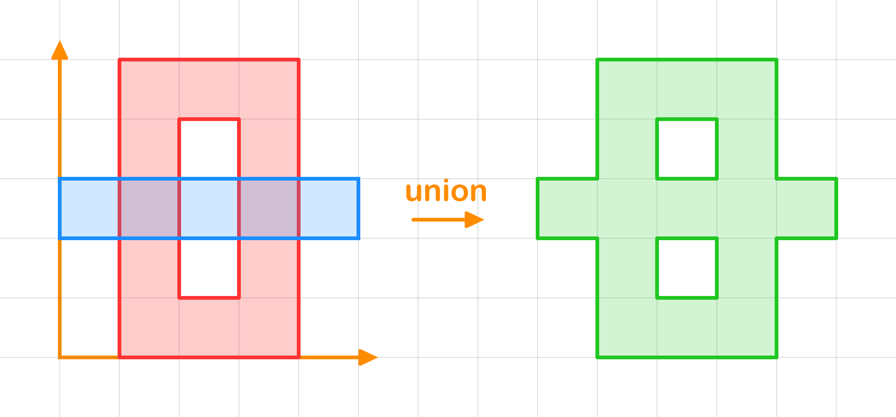
Here's an example of performing a union operation between two polygons:

```rust
use i_overlay::core::fill_rule::FillRule;
use i_overlay::core::overlay_rule::OverlayRule;
use i_overlay::float::single::SingleFloatOverlay;

// Define the subject "O"
let subj = [
    // main contour
    vec![
      [1.0, 0.0],
      [4.0, 0.0],
      [4.0, 5.0],
      [1.0, 5.0], // the contour is auto closed!
    ],
    // hole contour
    vec![
      [2.0, 1.0],
      [2.0, 4.0],
      [3.0, 4.0],
      [3.0, 1.0], // the contour is auto closed!
    ],
];

// Define the clip "-"
let clip = [
    // main contour
    [0.0, 2.0],
    [5.0, 2.0],
    [5.0, 3.0],
    [0.0, 3.0], // the contour is auto closed!
];

let result = subj.overlay(&clip, OverlayRule::Union, FillRule::EvenOdd);

println!("result: {:?}", result);
```
&nbsp;

The result is a vec of shapes:
```rust
[
    // first shape
    [
        // main contour (counterclockwise order)
        [
            [0.0, 3.0], [0.0, 2.0], [1.0, 2.0], [1.0, 0.0], [4.0, 0.0], [4.0, 2.0], [5.0, 2.0], [5.0, 3.0], [4.0, 3.0], [4.0, 5.0], [1.0, 5.0], [1.0, 3.0]
        ],
        // first hole (clockwise order)
        [
            [2.0, 1.0], [2.0, 2.0], [3.0, 2.0], [3.0, 1.0]
        ],
        // second hole (clockwise order)
        [
            [2.0, 3.0], [2.0, 4.0], [3.0, 4.0], [3.0, 3.0]
        ]
    ]
    // ... other shapes if present
]
```
&nbsp;

The `overlay` function returns a `Vec<Shapes>`:

- `Vec<Shape>`: A collection of shapes.
- `Shape`: Represents a shape made up of:
  - `Vec<Contour>`: A list of contours.
  - The first contour is the outer boundary (counterclockwise), and subsequent contours represent holes (clockwise).
- `Contour`: A sequence of points (`Vec<P: FloatPointCompatible>`) forming a closed contour.

**Note**: By default, outer boundaries are counterclockwise and holes are clockwise—unless `main_direction` is set. [More information](https://ishape-rust.github.io/iShape-js/overlay/contours/contours.html) about contours.


&nbsp;
### Overlay Rules
| A,B | A ∪ B | A ∩ B | A - B | B - A | A ⊕ B |
|---------|---------------|----------------------|----------------|--------------------|----------------|
| 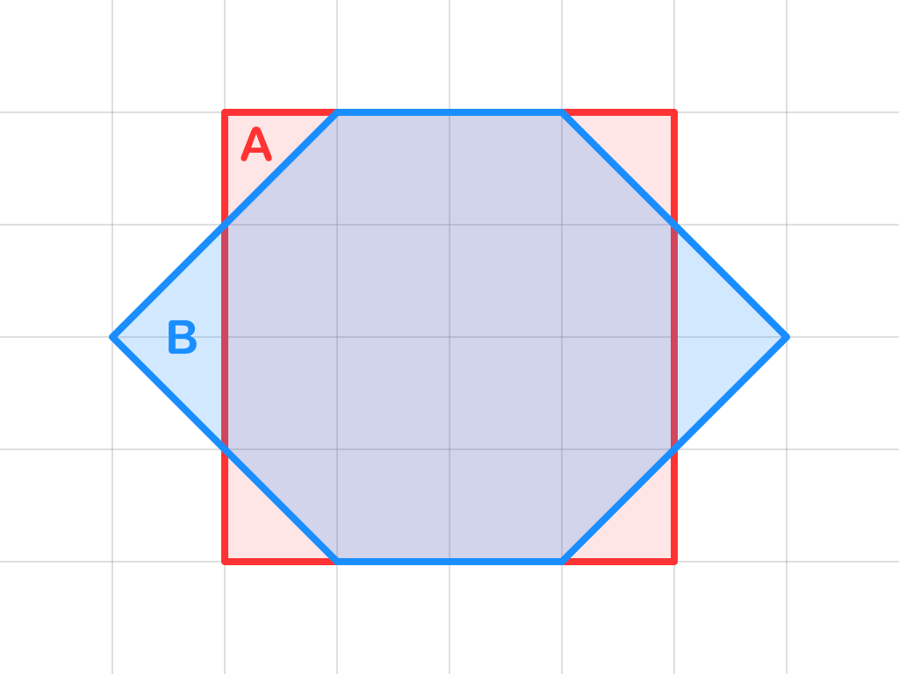 | 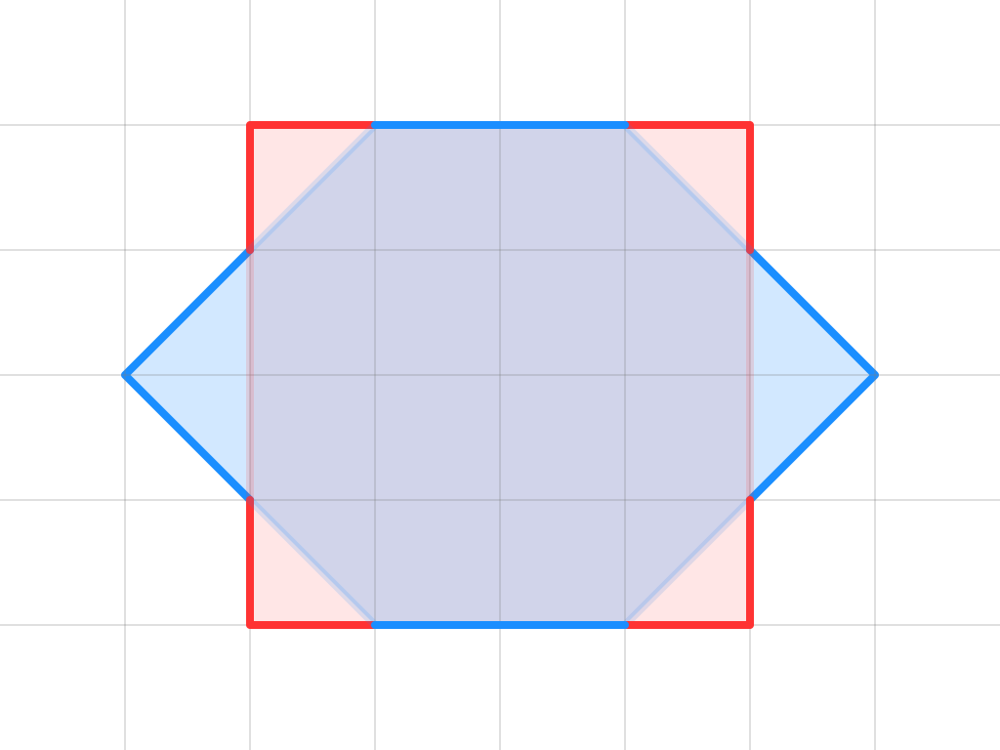 | 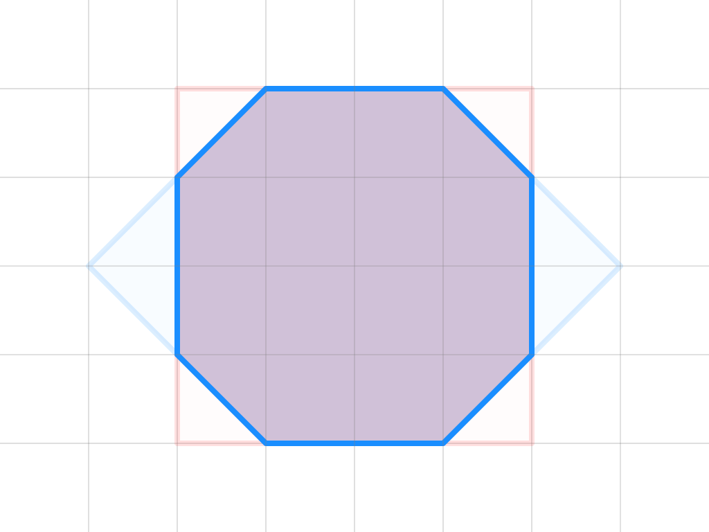 | 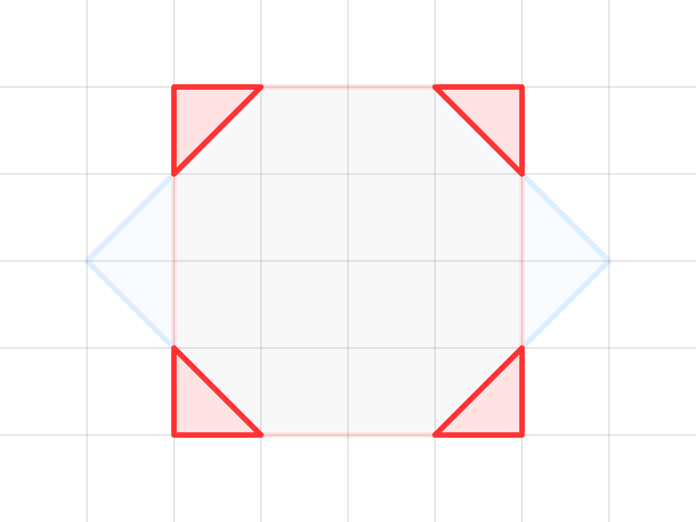 |  |  |

&nbsp;
## Custom Point Type Support
`iOverlay` allows users to define custom point types, as long as they implement the `FloatPointCompatible` trait.
```rust
use i_float::float::compatible::FloatPointCompatible;
use i_overlay::core::fill_rule::FillRule;
use i_overlay::core::overlay_rule::OverlayRule;
use i_overlay::float::single::SingleFloatOverlay;

#[derive(Clone, Copy, Debug)]
struct CustomPoint {
  x: f32,
  y: f32,
}

impl FloatPointCompatible<f32> for CustomPoint {
  fn from_xy(x: f32, y: f32) -> Self {
    Self { x, y }
  }

  fn x(&self) -> f32 {
    self.x
  }

  fn y(&self) -> f32 {
    self.y
  }
}

let subj = [
    CustomPoint { x: 0.0, y: 0.0 },
    CustomPoint { x: 0.0, y: 3.0 },
    CustomPoint { x: 3.0, y: 3.0 },
    CustomPoint { x: 3.0, y: 0.0 },
];

let clip = [
    CustomPoint { x: 1.0, y: 1.0 },
    CustomPoint { x: 1.0, y: 2.0 },
    CustomPoint { x: 2.0, y: 2.0 },
    CustomPoint { x: 2.0, y: 1.0 },
];

let result = subj.overlay(&clip, OverlayRule::Difference, FillRule::EvenOdd);

println!("result: {:?}", result);

```

&nbsp;
## Slicing & Clipping

### Slicing a Polygon with a Polyline
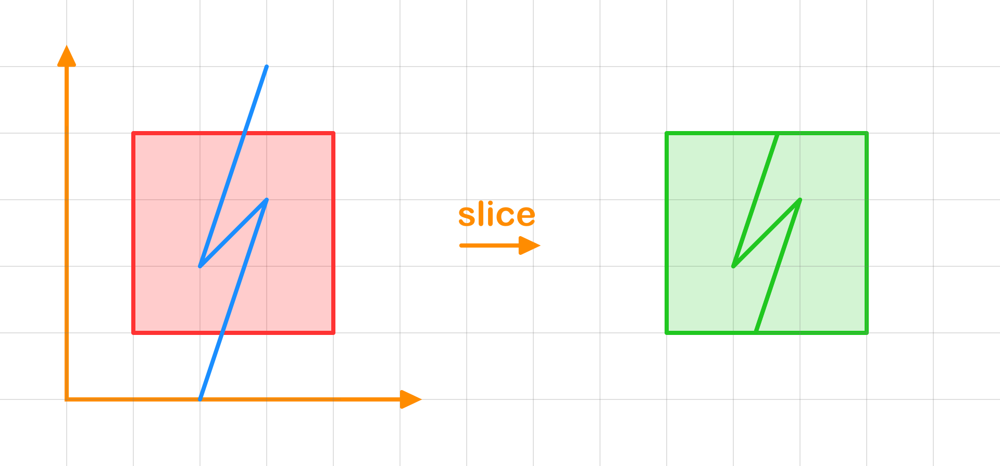

```rust
use i_overlay::core::fill_rule::FillRule;
use i_overlay::float::single::SingleFloatOverlay;
use i_overlay::float::slice::FloatSlice;

let polygon = [
    [1.0, 1.0],
    [1.0, 4.0],
    [4.0, 4.0],
    [4.0, 1.0],
];

let slicing_line = [
    [3.0, 5.0],
    [2.0, 2.0],
    [3.0, 3.0],
    [2.0, 0.0],
];

let result = polygon.slice_by(&slicing_line, FillRule::NonZero);

println!("result: {:?}", result);
```
&nbsp;

### Clipping a Polyline by a Polygon
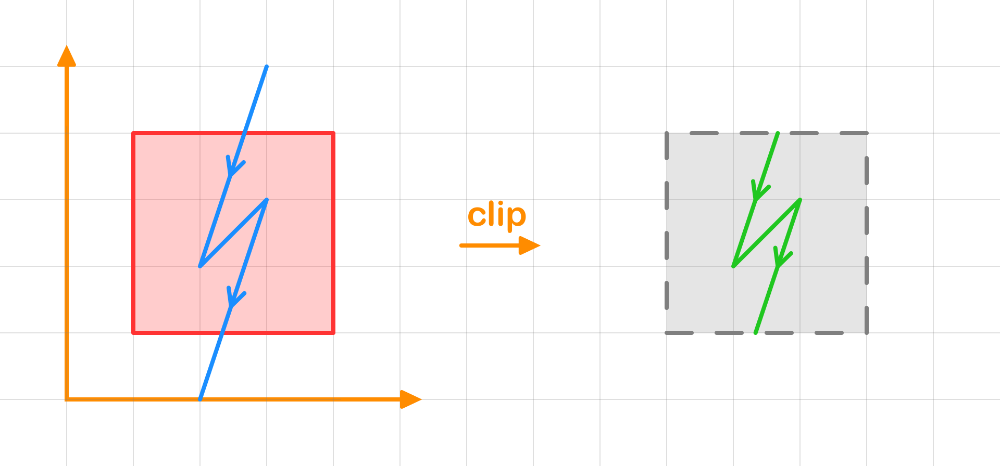

```rust
use i_overlay::core::fill_rule::FillRule;
use i_overlay::float::clip::FloatClip;
use i_overlay::float::single::SingleFloatOverlay;
use i_overlay::string::clip::ClipRule;

let polygon = [
    [1.0, 1.0],
    [1.0, 4.0],
    [4.0, 4.0],
    [4.0, 1.0],
];

let string_line = [
    [3.0, 5.0],
    [2.0, 2.0],
    [3.0, 3.0],
    [2.0, 0.0],
];

let clip_rule = ClipRule { invert: false, boundary_included: false };
let result = string_line.clip_by(&polygon, FillRule::NonZero, clip_rule);

println!("result: {:?}", result);
```

&nbsp;

## Buffering

### Offsetting a Path
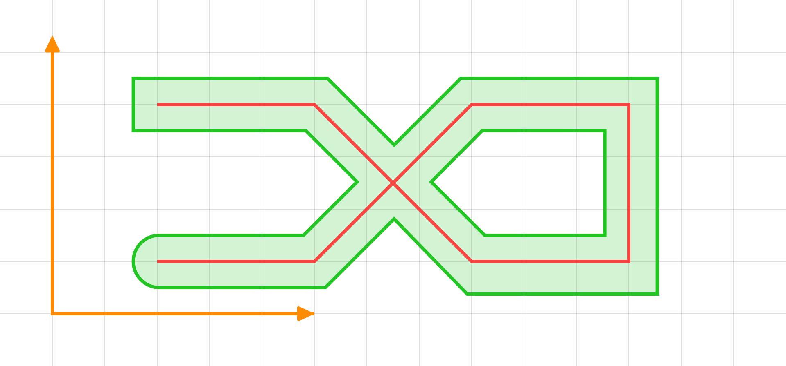

```rust
use i_overlay::mesh::stroke::offset::StrokeOffset;
use i_overlay::mesh::style::{LineCap, LineJoin, StrokeStyle};

let path = [
    [ 2.0, 1.0],
    [ 5.0, 1.0],
    [ 8.0, 4.0],
    [11.0, 4.0],
    [11.0, 1.0],
    [ 8.0, 1.0],
    [ 5.0, 4.0],
    [ 2.0, 4.0],
];

let style = StrokeStyle::new(1.0)
    .line_join(LineJoin::Miter(1.0))
    .start_cap(LineCap::Round(0.1))
    .end_cap(LineCap::Square);

let shapes = path.stroke(style, false);

println!("result: {:?}", shapes);
```
&nbsp;

### Offsetting a Polygon
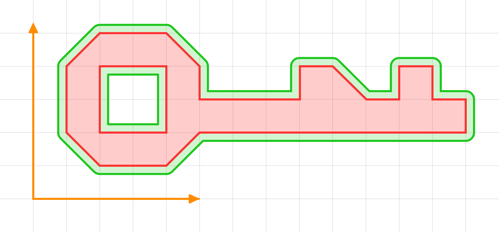

```rust
use i_overlay::mesh::outline::offset::OutlineOffset;
use i_overlay::mesh::style::{LineJoin, OutlineStyle};

let shape = vec![
    vec![
        [2.0, 1.0],
        [4.0, 1.0],
        [5.0, 2.0],
        [13.0, 2.0],
        [13.0, 3.0],
        [12.0, 3.0],
        [12.0, 4.0],
        [11.0, 4.0],
        [11.0, 3.0],
        [10.0, 3.0],
        [9.0, 4.0],
        [8.0, 4.0],
        [8.0, 3.0],
        [5.0, 3.0],
        [5.0, 4.0],
        [4.0, 5.0],
        [2.0, 5.0],
        [1.0, 4.0],
        [1.0, 2.0]
    ],
    vec![
        [2.0, 4.0],
        [4.0, 4.0],
        [4.0, 2.0],
        [2.0, 2.0]
    ],
];

let style = OutlineStyle::new(0.2).line_join(LineJoin::Round(0.1));
let shapes = shape.outline(style);

println!("shapes: {:?}", &shapes);
```

**Note**: 
- Offsetting a polygon works reliably only with valid polygons. Ensure that:
  - No self-intersections.
  - Outer boundaries are **counterclockwise**, holes are **clockwise**—unless `main_direction` is set.
  
  If polygon validity cannot be guaranteed, it is recommended to apply the [simplify_shape](https://github.com/iShape-Rust/iOverlay/blob/main/iOverlay/src/float/simplify.rs) operation before offsetting.  
  [More information](https://ishape-rust.github.io/iShape-js/overlay/contours/contours.html) on contour orientation.

- Using `LineJoin::Bevel` with a large offset may produce visual artifacts.

&nbsp;
### LineCap
| Butt | Square | Round | Custom |
|------|--------|-------|--------|
| 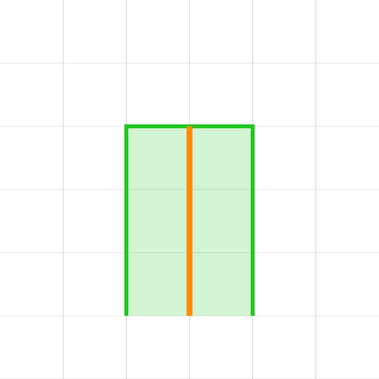 | 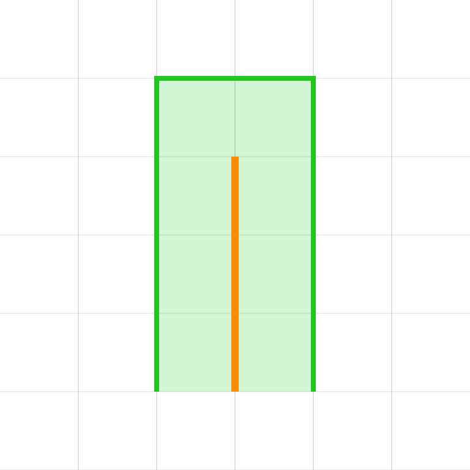 | 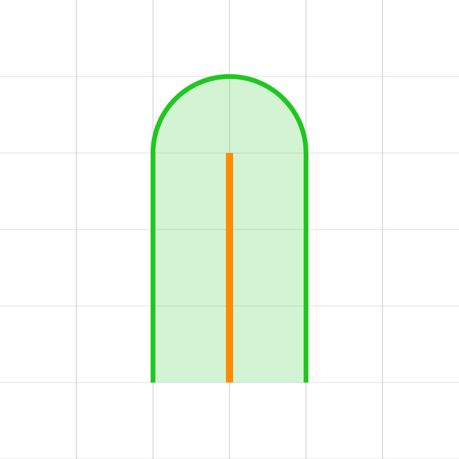 | 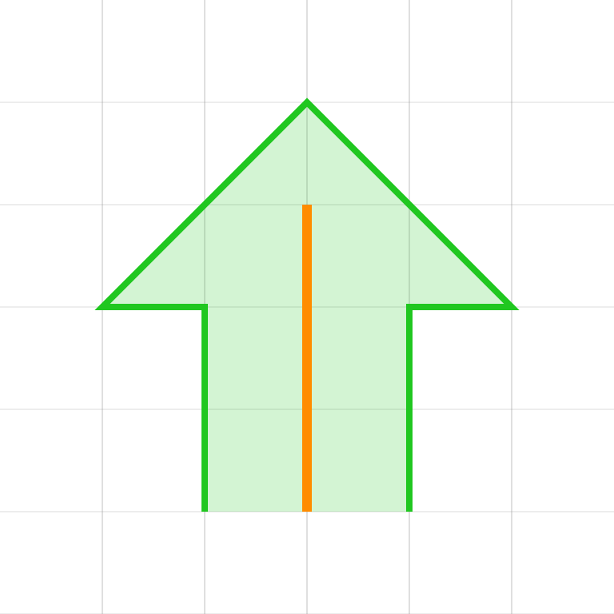 |

&nbsp;
### LineJoin
| Bevel | Miter | Round |
|-------|--------|-------|
| 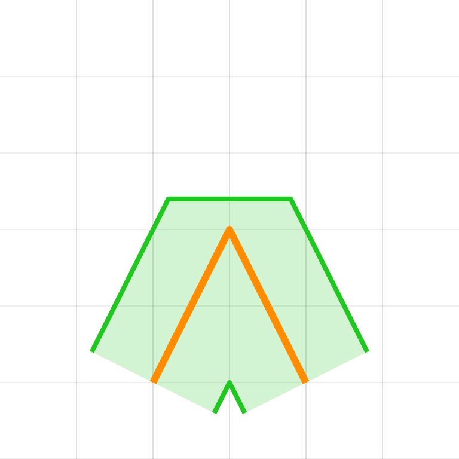 | 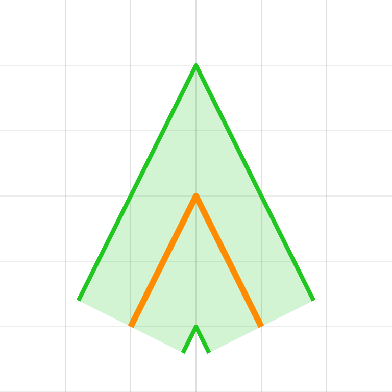 | 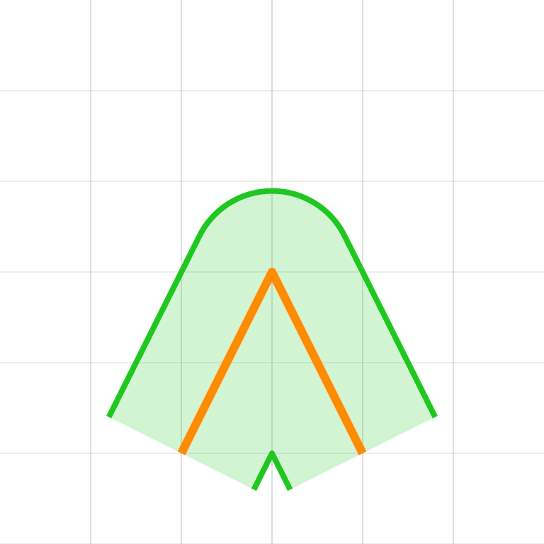 |

&nbsp;

## FAQ
### 1. When should I use `FloatOverlay`, `SingleFloatOverlay`, or `FloatOverlayGraph`?

- Use **`FloatOverlay`** when you perform **repeated overlay operations**:
  ```rust
  let mut overlay = FloatOverlay::new();
  loop {
      overlay.clear();
      overlay.add_source(shape);
      let result = overlay.overlay(overlay_rule, fill_rule);
      // ...
  }
  ```

- Use **`SingleFloatOverlay`** trait for **one-shot operations**.

- Use **`FloatOverlayGraph`** if you need to extract **multiple boolean results** (e.g. union and intersection) from the **same input geometry** without recomputing.

---

### 2. I need to union many shapes at once. What's the most efficient way?

Use the [`simplify`](https://github.com/iShape-Rust/iOverlay/blob/main/iOverlay/src/float/simplify.rs) operation:

```rust
let result = shapes.simplify(fill_rule);
```

It internally merges shapes efficiently and is typically faster and more robust than chaining many `overlay()` calls manually.

---

### 3. How do I use a fixed grid size (fixed precision) for float overlays?

Use `FixedScaleFloatOverlay` or `FloatOverlay::with_subj_and_clip_fixed_scale`. The scale is
`scale = 1.0 / grid_size`.

```rust
use i_overlay::core::fill_rule::FillRule;
use i_overlay::core::overlay_rule::OverlayRule;
use i_overlay::float::scale::FixedScaleFloatOverlay;

let subj = vec![[0.0, 0.0], [0.0, 5.0], [5.0, 5.0], [5.0, 0.0]];
let clip = vec![[2.0, 2.0], [2.0, 4.0], [4.0, 4.0], [4.0, 2.0]];

let grid_size = 0.001;
let scale = 1.0 / grid_size;

let result = subj
    .overlay_with_fixed_scale(&clip, OverlayRule::Difference, FillRule::EvenOdd, scale)
    .expect("scale does not fit input bounds");
```

If you need more control, use `FloatPointAdapter::with_scale` and `FloatOverlay::with_adapter`.

---

### 4. How do I enable OGC-valid output?

Set the `ocg` flag in `OverlayOptions`.

```rust
use i_overlay::core::fill_rule::FillRule;
use i_overlay::core::overlay_rule::OverlayRule;
use i_overlay::float::overlay::{FloatOverlay, OverlayOptions};

//     0   1   2   3   4   5
//   5 ┌───────────────────┐
//     │                   │
//   4 │   ┌───────┐       │
//     │   │ ░   ░ │       │   Two L-shaped holes share vertices at (2,2) and (3,3)
//   3 │   │   ┌───●───┐   │
//     │   │ ░ │   │ ░ │   │   ░ = holes
//   2 │   └───●───┘   │   │
//     │       │ ░   ░ │   │   The shared edge disconnects the interior
//   1 │       └───────┘   │
//     │                   │
//   0 └───────────────────┘
//
// OGC Simple Feature Specification (ISO 19125-1) states:
// "The interior of every Surface is a connected point set."

let subj = vec![vec![[0.0, 0.0], [5.0, 0.0], [5.0, 5.0], [0.0, 5.0]]];
let clip = vec![
    vec![[1.0, 2.0], [1.0, 4.0], [3.0, 4.0], [3.0, 3.0], [2.0, 3.0], [2.0, 2.0]],
    vec![[2.0, 1.0], [2.0, 2.0], [3.0, 2.0], [3.0, 3.0], [4.0, 3.0], [4.0, 1.0]],
];

let options = OverlayOptions::<f64>::ocg();
let mut overlay = FloatOverlay::with_subj_and_clip_custom(&subj, &clip, options, Default::default());
let result = overlay.overlay(OverlayRule::Difference, FillRule::EvenOdd);

assert_eq!(result.len(), 2);
```

---

## Versioning Policy

This crate follows a pragmatic versioning approach:

    PATCH updates (e.g., 1.8.1 → 1.8.2): Guaranteed to be backward-compatible, containing only bug fixes or small improvements.
    MINOR updates (e.g., 1.8.0 → 1.9.0): Typically backward-compatible but may include changes to experimental or less commonly used APIs.
    MAJOR updates (e.g., 1.x.x → 2.x.x): Reserved for significant breaking changes or major redesigns.

To minimize disruption, consider pinning dependencies when relying on specific versions.
